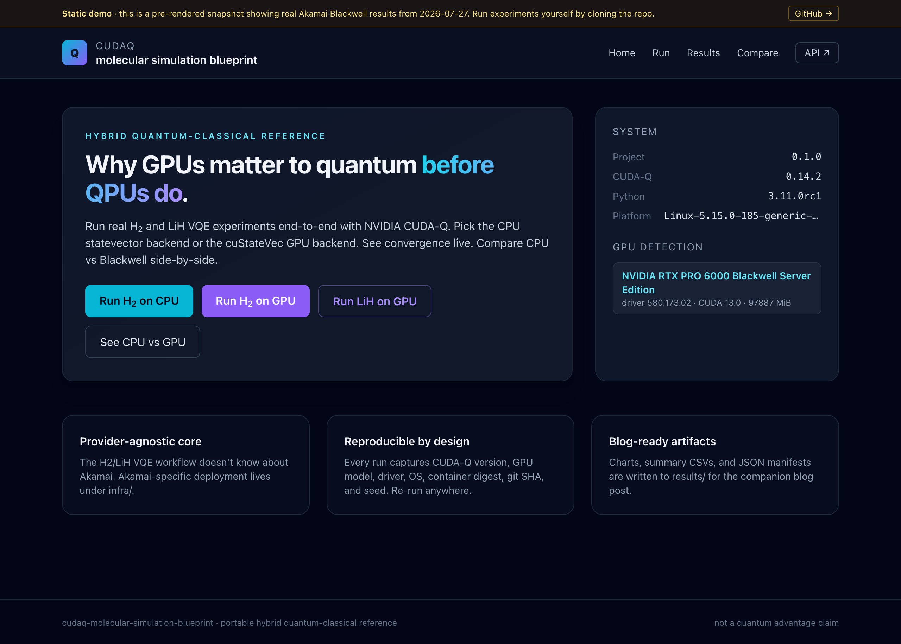
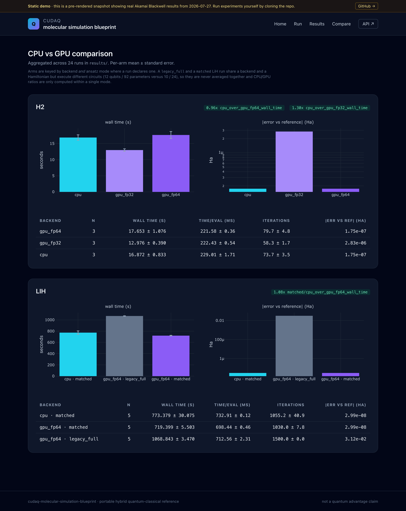
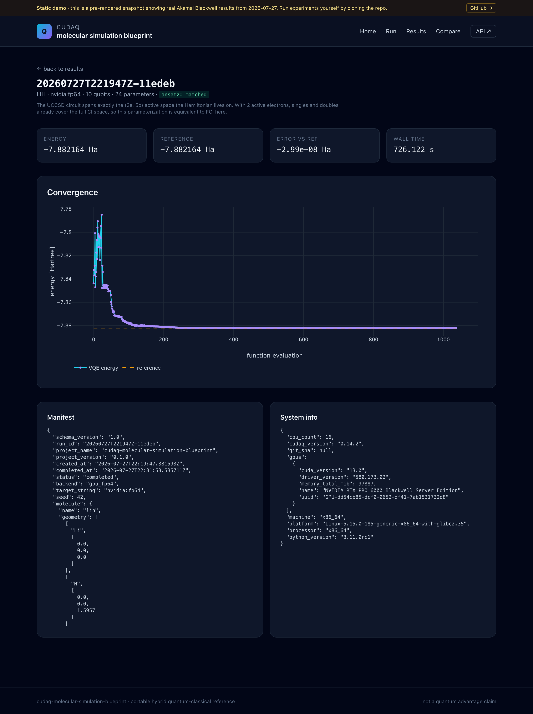
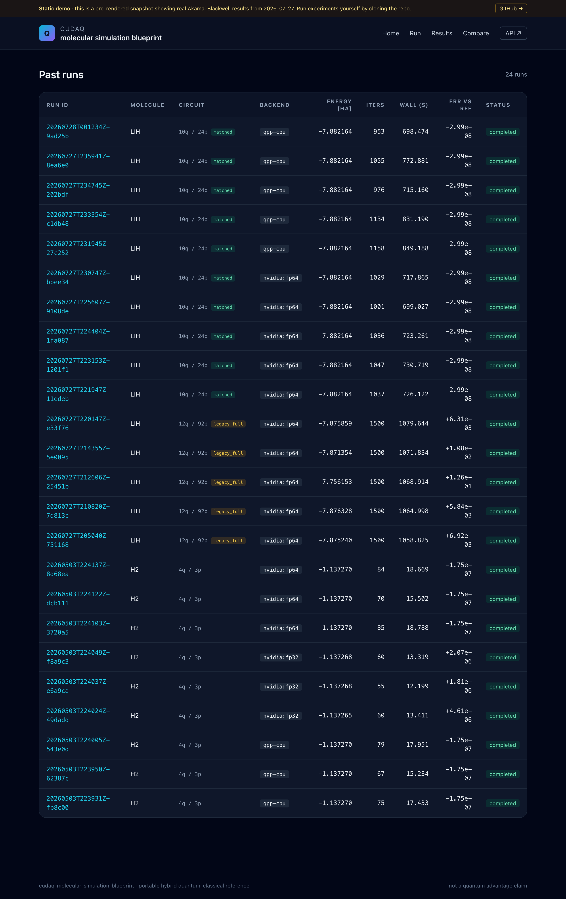
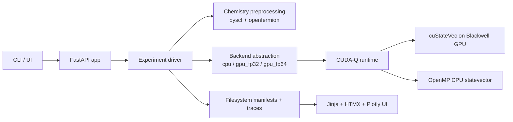

# cudaq-molecular-simulation-blueprint

> Hybrid quantum-classical molecular simulation reference implementation
> using NVIDIA CUDA-Q and cuQuantum, validated end-to-end on Akamai Cloud
> NVIDIA RTX PRO 6000 Blackwell GPUs.

[](https://github.com/jgdynamite/cudaq-molecular-simulation-blueprint/actions/workflows/ci.yml)
[](LICENSE)
[](https://www.python.org/downloads/)
[](https://nvidia.github.io/cuda-quantum/)

**Live UI demo (Akamai Object Storage):**
**<https://cudaq-blueprint-demo.website-us-east-1.linodeobjects.com/>**

[](https://cudaq-blueprint-demo.website-us-east-1.linodeobjects.com/)

The live demo is a pre-rendered snapshot of the FastAPI/HTMX UI hosted from
an Akamai Object Storage bucket. It shows the actual Blackwell host
fingerprint (RTX PRO 6000 Blackwell Server Edition, driver 580.173.02,
CUDA 13.0, 96 GB VRAM) and embeds 24 real run manifests, traces, and the
comparison report inline &mdash; 9 H2 runs from the 2026-05-04 multi-seed
bench plus all 15 LiH runs from the 2026-07-27 ansatz follow-up. The
"Run an experiment" form is intentionally inert in static mode &mdash;
clone the repo to run live.

This project supports the technical blog post **"Why GPUs Matter to Quantum
Before QPUs Do: Using CUDA-Q, cuQuantum, and Blackwell GPUs for Molecular
Simulation."** It exists to make the hybrid quantum workflow concrete,
runnable, and reproducible.

It is **not** a quantum-advantage claim, **not** a positioning of Akamai as
a dedicated quantum cloud, and **not** a cross-cloud benchmark. It **is** a
portable, public, Akamai-validated Blackwell-era reference implementation
for molecular simulation that you can read, run, and extend.

### Why this matters to IT decision-makers

This repository is a small, end-to-end example of how to evaluate an
emerging accelerated workload responsibly &mdash; published code, published
manifests, multi-seed measurements with stderr, and a reproducible hardware
path on Akamai Cloud Blackwell infrastructure. It also illustrates that
today's GPUs already have a role beyond AI inference and training: they
are the computational substrate the hybrid quantum workflow runs on right
now, well before any QPU column has a useful number in it.

The current evidence supports a **technical infrastructure thesis**
(Blackwell-class GPUs are a viable platform for the hybrid quantum
workloads available today, and Akamai Cloud is one validated path to
running them), not a broader competitive platform claim about quantum
computing in general.

---

## Validated on Blackwell (Jakarta, multi-seed re-bench 2026-05-04)

Each backend was run with three RNG seeds (42, 43, 44) on a fresh
`g3-gpu-rtxpro6000-blackwell-1` VM in Akamai's `id-cgk` region. NVIDIA
driver `nvidia-open-580.159.03` (`nvidia-smi` reports max-supported
CUDA 13.0); container uses `cuda-quantum-cu13` wheels on top of the
CUDA 12.6 base image. 96 GB VRAM, 16 vCPU, 172 GB system RAM.

15 specs total. **2 h 27 min of bench compute.** Total billed VM
lifetime was ~3 h 35 min (provisioning, NVIDIA driver install +
reboot, container build, bench, results export, one mid-cycle reboot
to clear `MaxStartups`, teardown), and at Akamai's `id-cgk` regional
rate of $3.00/hr the VM cost ~$10.75 end-to-end &mdash; **not** 2 h 27
min × $2.50/hr. The `id-cgk` and `br-gru` regions carry a $0.50/hr
uplift over the $2.50/hr base SKU rate.

| Molecule | Backend | n | Wall (s) mean ± stderr | Energy mean (Ha) | min &#124;err vs CASCI(2e,5o)&#124; (mHa) | chem. acc.<sup>†</sup> |
|---|---|:-:|---:|---:|---:|:-:|
| H2  | `qpp-cpu`     | 3 | **16.87 ± 0.83** | -1.137270 | < 0.001 | 3 / 3 |
| H2  | `nvidia:fp32` | 3 | **12.98 ± 0.39** | -1.137267 | 0.002 | 3 / 3 |
| H2  | `nvidia:fp64` | 3 |   17.65 ± 1.08   | -1.137270 | < 0.001 | 3 / 3 |
| LiH | `qpp-cpu`     | 3 |   1809.12 ± 7.03 | -7.835907 |   5.84 | 0 / 3 |
| LiH | `nvidia:fp64` | 3 | **1086.56 ± 4.19** | -7.835907 |   5.84 | 0 / 3 |

<sup>†</sup> Chemical accuracy = `|error| < 1.6 mHa`. H2 references are
FCI; LiH references are CASCI(2e,5o), both recomputed from PySCF on
2026-05-04 to replace a v0.1.0 literature estimate that was off by
~19.7 mHa for the LiH (2e,5o) value. See
[`results/akamai-blackwell-multiseed/`](results/akamai-blackwell-multiseed/)
for the per-run summary and the recomputation recipe.

GPU/CPU wall-time speedups:

- H2 / FP64: **0.96×** &mdash; FP64 GPU is slightly *slower* than CPU
  on a 4-qubit problem, well within stderr. Host&harr;device transfer
  dominates at this size.
- H2 / FP32: **1.30×** &mdash; lighter precision overhead pays off on
  the small statevector.
- **LiH / FP64: 1.665×** &mdash; the speedup is real and the variance
  bars are tight (~0.4% relative stderr on each backend).

The LiH rows above are **superseded** &mdash; see the next section. No LiH
seed reached chemical accuracy here, and one of three landed ~126 mHa away
in a different basin. At the time the cause was an open question; it has
since been isolated and fixed.

## The LiH result was an ansatz bug, not a hardware limit (2026-07-27)

The LiH Hamiltonian is built for a (2 electron, 5 orbital) active space, a
10-qubit operator. Through v0.1 the UCCSD ansatz was dimensioned from
full-molecule metadata instead, producing a **12-qubit / 92-parameter**
circuit for a 10-qubit problem. v0.2 made this an explicit choice, and a
controlled follow-up ran both dimensionings against the same Hamiltonian:
three arms, five seeds each, identical 1500-iteration COBYLA budget,
15 LiH runs on one Blackwell host in `us-east`.

| Arm | Circuit | Iterations | Wall (s) mean ± stderr | &#124;error&#124; vs CASCI(2e,5o) (mHa) | chem. acc. |
|---|---|---|---:|---|:-:|
| `legacy_full` / `nvidia:fp64` | 12q, 92p | 1500 (cap hit, 5/5) | 1068.84 ± 3.47 | mean 31.18, median 6.92, max 126.01 | **0 / 5** |
| `matched` / `nvidia:fp64` | 10q, 24p | 1030 (converged) | **719.40 ± 5.50** | **0.0000** | **5 / 5** |
| `matched` / `qpp-cpu` | 10q, 24p | 1055 (converged) | 773.38 ± 30.07 | **0.0000** | **5 / 5** |

Matching the circuit to the active space takes LiH from **0/5 seeds
reaching chemical accuracy to 5/5**. Every matched run recovered
CASCI(2e,5o) = -7.882164 Ha to `-7.8821640299` &mdash; about 1e-13 Ha
&mdash; on all five seeds and both backends, with zero spread. Every
`legacy_full` run exhausted its budget without converging.

That exactness is expected rather than lucky: with 2 active electrons,
singles and doubles already span the entire CI space of the active space,
so UCCSD is equivalent to FCI for this problem once dimensioned correctly.

**Do not read the 1.49× wall-time win as a GPU result.** It comes from
needing fewer and cheaper evaluations (1030 vs 1500, at 698.4 vs 712.6 ms),
not from acceleration. The honest CPU-versus-GPU number for the same
circuit is **1.075×**, GPU utilization sampled **0%** with 621 MiB
allocated, and a 10-qubit statevector is 1024 amplitudes &mdash; these runs
are bound by Python and CUDA-Q per-`observe()` overhead, not linear
algebra. This sweep has no `legacy_full` CPU arm, so it neither reproduces
nor refutes the 1.665× LiH figure above.

As a correctness check, CPU and GPU FP64 agreed on all five matched seeds
to a maximum absolute difference of **6.6e-13 Ha**, zero violations of a
1e-8 Ha tolerance.

Full numbers, provenance, and the reproduction command are in
[`results/lih-active-space-followup-v02/`](results/lih-active-space-followup-v02/).
VM lifetime 3 h 54 min at $3.00/hr = **$11.74**; run in `us-east` because
Blackwell now carries a $1.50/hr surcharge in `id-cgk`.

[](https://cudaq-blueprint-demo.website-us-east-1.linodeobjects.com/compare/)

The comparison page keys arms by backend *and* ansatz mode, so the two LiH
circuits are never averaged together and CPU/GPU ratios are only computed
within a single mode.

Each run is drillable. Below is the seed-42 matched LiH GPU run on the
Blackwell card &mdash; convergence to the CASCI reference, with the full
manifest and host fingerprint inline:

[](https://cudaq-blueprint-demo.website-us-east-1.linodeobjects.com/results/20260727T221947Z-11edeb/)

[](https://cudaq-blueprint-demo.website-us-east-1.linodeobjects.com/results/)

Committed lightweight artifacts (15-row `SUMMARY.csv` + aggregate
`comparison.json`) live under
[`results/akamai-blackwell-multiseed/`](results/akamai-blackwell-multiseed/).
Full per-run manifests and traces are not in the repository; re-run the
bench with `uv run cudaq-bp bench run-suite` on a fresh Blackwell host
to regenerate them. See
[docs/results-interpretation.md](docs/results-interpretation.md) for the
methodology and full discussion.

---

## Quick start (CPU, runs anywhere with Docker)

```bash
git clone https://github.com/jgdynamite/cudaq-molecular-simulation-blueprint.git
cd cudaq-molecular-simulation-blueprint

make container-build         # builds the multi-stage image (~5-8 min first time)
make container-run-cpu       # H2 VQE on qpp-cpu (converges in ~15-20 s)
make serve                   # demo UI on http://localhost:8000
```

CUDA-Q's Python wheel ships only Linux x86_64/ARM64 binaries (`cuda-quantum-cu12`
and `-cu13` on PyPI). On macOS or any other platform without those wheels,
use the Docker-based path above; the container handles the Linux runtime
transparently.

For a native Linux dev loop:

```bash
uv sync                                       # creates .venv with all deps
uv run cudaq-bp run h2 --backend cpu          # H2 VQE on the CPU
uv run cudaq-bp info                          # shows detected GPUs / backends
uv run pytest -m "not gpu and not slow"       # 36 tests in ~5 s
```

---

## GPU on Akamai (the validated path)

Provision an RTX PRO 6000 Blackwell VM, configure it, run the suite, tear
it down:

```bash
export LINODE_TOKEN=...
cd infra/terraform/akamai
cp terraform.tfvars.example terraform.tfvars  # then edit: SSH key, region, etc.

terraform init
terraform plan -out=tfplan
terraform apply tfplan                         # ~1-2 min
ansible-playbook -i inventory.ini ../../ansible/playbook.yml \
                 --private-key ~/.ssh/your-key  # ~12-15 min

ssh root@$(terraform output -raw public_ip) \
    "docker exec -u root -w /tmp cudaq-blueprint cudaq-bp bench compare"

terraform destroy                              # mandatory; cost meter stops
```

Akamai's RTX PRO 6000 Blackwell SKU is feature-gated; talk to your account
team to get it enabled. Stock currently lives in `id-cgk` (Jakarta) and
`br-gru` (Sao Paulo). Full walkthrough including firewall, NVIDIA driver
flavor, and image-distribution strategy in
[docs/akamai-deployment.md](docs/akamai-deployment.md).

---

## Deploy a public read-only UI snapshot (Akamai Object Storage)

Once you have benchmark results in `results/`, you can pre-render the UI to
a static bundle and host it on Akamai Object Storage for ~$5/month flat. The
result is the public `website-...linodeobjects.com` URL linked at the top
of this README.

```bash
uv run python -m app.ui.static_export \
    --results-dir results/akamai-blackwell-multiseed \
    --output-dir _site

# Object Storage credentials must be created via Cloud Manager or the
# Linode API: POST /v4/object-storage/buckets and POST /v4/object-storage/keys
# (scope the key to the bucket only). Then:
aws s3 sync _site/ s3://<your-bucket>/ \
    --endpoint-url https://us-east-1.linodeobjects.com --acl public-read
aws s3api put-bucket-website --bucket <your-bucket> \
    --endpoint-url https://us-east-1.linodeobjects.com \
    --website-configuration \
    '{"IndexDocument":{"Suffix":"index.html"},"ErrorDocument":{"Key":"404.html"}}'
```

Notes from this project's first deployment:

- The bucket-creation API picks a sub-cluster automatically. We hit a
  broken `us-iad-10` cluster on first try (TLS handshake reset on every
  connection); recreating in `us-east` got us a healthy `us-east-1`
  bucket. If you see "Connection reset by peer" on `aws s3 ls`, delete
  the bucket and pick a different region.
- Set ACL to `public-read` on objects and explicitly `Content-Type:
  text/html; charset=utf-8` on every `index.html` (the auto-detection
  via `aws s3 sync` defaulted to `application/octet-stream` for some
  HTML files and the browser would offer them as a download).
- Use the `bucket.website-<cluster>.linodeobjects.com` URL for browsing,
  not the `bucket.<cluster>.linodeobjects.com` S3 endpoint. Only the
  former auto-resolves `/run/` to `/run/index.html`.

---

## What this project does



- Hartree-Fock chemistry preprocessing on CPU (`pyscf` + `openfermion`)
- Hamiltonian construction via `cudaq.chemistry.create_molecular_hamiltonian`
- UCCSD ansatz from `cudaq.kernels.uccsd` over a Hartree-Fock reference
- VQE optimization via SciPy COBYLA with full per-evaluation iteration trace
- Statevector simulation on either `qpp-cpu` (OpenMP) or `nvidia:fp64`
  (cuStateVec on the GPU)
- Side-by-side benchmarks comparing the two backends on H2 and LiH
- Live SSE-driven convergence plot in the demo UI

## Repository layout

```
cudaq-molecular-simulation-blueprint/
  app/            # provider-agnostic application (no Akamai-specific code)
    api/          # FastAPI routes + run coordinator
    cli/          # Typer CLI: cudaq-bp run|results|bench|info
    core/         # config, structlog, system info
    quantum/      # chemistry, ansatz, optimizers, H2/LiH VQE drivers
    benchmark/    # CPU vs GPU comparison harness
    storage/      # JSON manifests + traces on the filesystem
    ui/           # Jinja2 + HTMX + Tailwind (CDN) + Plotly (CDN)
    tests/        # 36 fast tests, no GPU required
  containers/     # Dockerfile + compose + entrypoint
  infra/          # Akamai-specific deployment (isolated)
    terraform/akamai/
    ansible/      # nvidia_driver, docker, app roles
    k8s/future/   # placeholder; LKE explicitly out of scope for v1
  docs/           # charter, architecture, methodology, deployment, results
  scripts/        # bootstrap, verify-gpu, run-* helpers
  results/        # written run artifacts (gitignored except .gitkeep)
  .github/workflows/  # ci, docs, release (-> GHCR)
```

## Documentation

- [Project charter](docs/project-charter.md)
- [Architecture](docs/architecture.md)
- [Experiment methodology](docs/experiment-methodology.md)
- [Akamai deployment](docs/akamai-deployment.md)
- [Results interpretation](docs/results-interpretation.md)
- [Scope and non-goals](docs/scope-and-non-goals.md)
- [Blog support notes](docs/blog-support-notes.md)

## Reproducibility

Every run produces a JSON manifest capturing CUDA-Q version, target string,
GPU model, driver version, OS, container digest, git SHA, RNG seed,
optimizer settings, basis set, geometry, and active space. CI reproduces
the H2 CPU result on every push. The release workflow publishes the
canonical container image to
`ghcr.io/jgdynamite/cudaq-molecular-simulation-blueprint:<tag>` so any
reader can pull-and-run the exact bits used in the blog post.

## License

[MIT](LICENSE)
